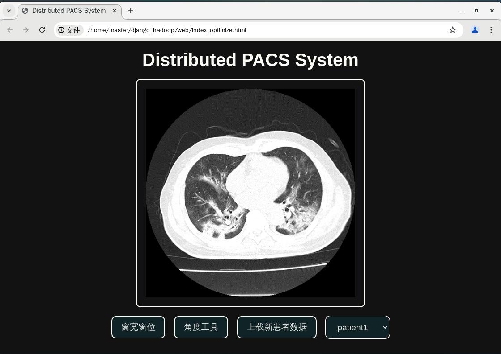

# README

## 如何运行分布式存储的 PACS 系统

本项目搭建了一个分布式 PACS 系统，使用 Django 框架作为前后端，Cornerstone.js 用于医学影像显示，Hadoop 2.7 搭建分布式文件系统。以下是详细的运行步骤：

### 环境搭建

1. **Hadoop 分布式系统搭建**

   在 VMware 中创建三个 CentOS 虚拟机（master, s1, s2），并基于 Hadoop 2.7 搭建分布式架构。主节点设置为 master。

2. **Python 环境配置**

   在虚拟机上配置 Python 环境，确保安装 Django 和 HDFS 库。可以使用以下命令安装：
   
   ```bash
   pip install django hdfs
   ```
### 文件系统配置
1. **创建 HDFS 分布式文件夹**
   
   在 Hadoop 文件系统中创建一个目录用于存放患者的 DICOM 数据：
      ```bash
   hadoop fs -mkdir /PATIENTDCM_DICTIONARY
   ```

2**上传初始数据集**
   将初始的患者数据上传到 HDFS 中：
   ```bash
   hadoop fs -put /path/to/PATIENTDATA /PATIENTDCM_DICTIONARY
   ```

### 项目配置
1. **修改服务器配置**

   在项目的 `server/views.py` 文件中，修改 `PATIENTDCM_DIR` 变量为你定义的 HDFS 文件路径 `PATIENTDCM_DICTIONARY`。
   ```bash
   PATIENTDCM_DIR = "/path/to/PATIENTDCM_DICTIONARY"
   ```

### 运行项目
1. **启动 Django 服务**

   在项目根目录下运行 Django 服务：
   ```bash
   python manage.py runserver
    ```
2. **访问网页**

   在浏览器中打开 `web/index_optimize.html` 即可访问系统的 Web 界面。


### 示例展示



### 致谢

感谢以下资源和项目的帮助：

- [PACS Tutorial by Shenxianglong](https://github.com/shenxianglong/pacs-tutorial)